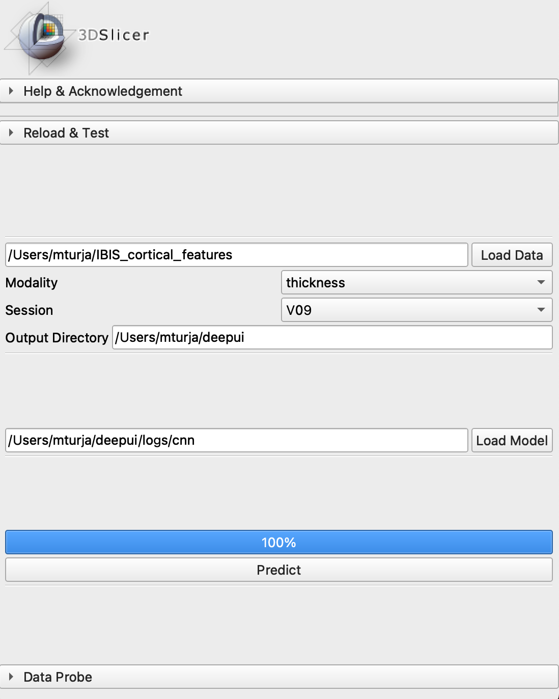

# SlicerInferenceModule
This module is designed to enable inference on new datasets using the trained models from SlicerDeepLearner.


## Input Format
### Data Format
The input directory (after pressing "Load Data" button) must follow the same folder hierarchy as the SlicerDeepLearner input directory.
This directory should be organized to contain a separate folder for each subject. Each subject's folder should then have its own subfolders 
for different sessions (6 months, 12 months, etc.), and within these session folders, there should be separate folders for images belonging to various modalities (cortical thickness, ea-csf, etc.).
```
root_data_folder
| ---- subject_id
       | ---- session
              | ---- modality
                     | ---- left_<modality>_flat.jpeg
                     | ---- right_<modality>_flat.jpeg
```
Users should also choose the appropriate `session` and `modality` for which they want to make the prediction.

### Model Format
There are two possible input formats for model (after pressing "Load Model"):
1. The model can be loaded from a file with the .pt extension generated by the training process of the SlicerDeepLearner module.
2. Alternatively, the model can be loaded from a directory path that points to the `<Training Output Directory>/logs/<model>` folder, which contains all the models for different cross-validation folds. 
In this scenario, the prediction will be computed using a "Majority Voting" method, which combines the predictions of all the models in that directory.

## Output Format
The output will be saved in `<Output Directory>/<Session>/<Modality>/predictions.csv` file.