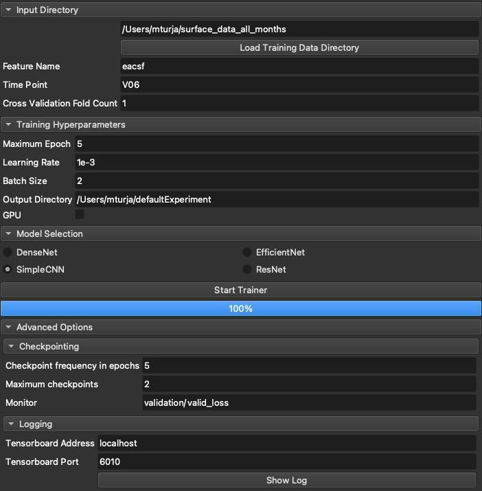

# SlicerDeepLearningUI
## Introduction
This module enables the user to easily train complex deep learning models (such as ResNet, EfficientNet, CNN etc.) without the need for any coding. Given that the training dataset is in certain format (explained later), all the user has to do is to input the data directory, select a model from model pool and push the `Start Trainer` button. The rest will be taken care of by this extension.
## How to use
### Data preparation
For the module to work, the user has to organize the data in the following manner:
```
root_data_folder
| ---- subject_id
       | ---- time_stamp
              | ---- feature_name
                     | ---- left_<feature_name>_flat.jpeg
                     | ---- right_<feature_name>_flat.jpeg
```
So for each subject, there can be data for multiple timestamps and multiple feature set. The user can choose to train the model for a particular timestamp and a particular feature set. The jpeg images are 2D images for left and right hemisphere of the brain. The shape of the images must match across hemisphere and population.
#### Example:

## Environment Setup
Install the following libraries using `pip` in Slicer-Python environment
```
monai==0.7.0
numpy==1.19.2
pytorch_lightning==1.4.9
pandas==1.1.5
torch==1.9.0
torchmetrics==0.6.0
```
## UI Screenshot

