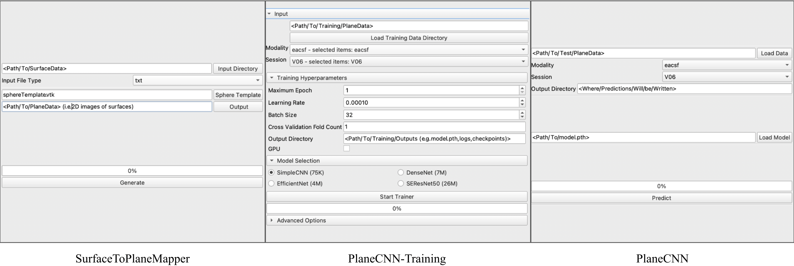

# SurfaceLearner
This is a GitHub repository containing an extension for Slicer/SlicerSALT. The primary objective of this extension is to facilitate the application of Deep Learning-based Image Classifiers on surface data, such as the Brain Cortical Surface, Hippocampus, or any other 3D surface with a spherical topology. The extension provides a user-friendly interface allowing users to effortlessly train and utilize complex deep-learning models without any coding.

The extension first transforms a 3D surface into a 2D grid through an area-preserving projection technique. These 2D images are then employed for training Deep Image Classifiers models, chosen from a selection of popular CNN-based architecutures (e.g. ResNet, EfficientNet, etc). The trained model can then be used to make prediction on new surface dataset. SurfaceLearner consists of three modules that work together to achieve specific tasks:

1. [SurfacePlaneMapper](https://github.com/mturja-vf-ic-bd/SlicerDeepLearningUI/tree/update_reame_files/GeometryImage): This module is responsible for mapping a 3D surface onto a 2D plane.
2. [PlaneCNN-Training](https://github.com/mturja-vf-ic-bd/SlicerDeepLearningUI/tree/update_reame_files/DeepLearner): This module focuses on training a Deep Image Classifier using the 2D images obtained from the `SurfacePlaneMapper` module.
3. [PlaneCNN](https://github.com/mturja-vf-ic-bd/SlicerDeepLearningUI/tree/update_reame_files/Inference): This module uses the trained classifier to perform predictions on new sets of 2D images.

Each module is a standalone program and can be utilized independently. For instance, you can use the `PlaneCNN-Training` module to train the CNN using any set of 2D images, even if they were not generated by the `SurfacePlaneMapper` module.

## How to Use
To understand how to prepare input data, navigate through the user interface (UI), and interpret the results, refer to the links for specific module within the repository. Below are the snapshots of the UI's of each module.

